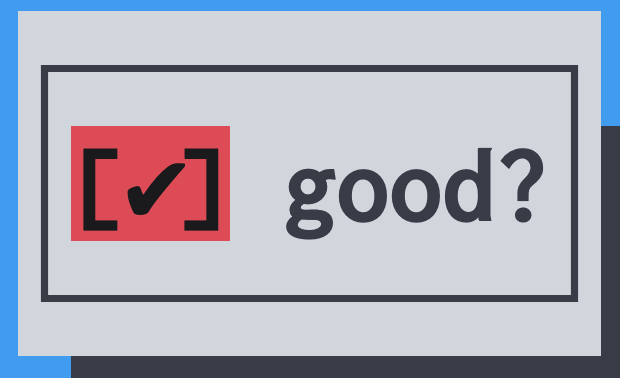

# Cursivext

[](https://crates.io/crates/cursivext)
[](https://docs.rs/cursivext)

[](../License)

## Get Started

### Checkbox



```rust
use cursivext::{cursive, views::Checkbox};
use cursive::{With, views::Panel};

let checkbox = Checkbox::wrap_linear_layout("good?").wrap_with(Panel::new);

cursive::default()
  .with(|siv| siv.add_layer(checkbox));
  .run();

  // => [✔︎] good?
```

**Note:** The original cursive 0.21.1 Checkbox is `[X] good?` instead of `[✔︎] good?`.

### cursive-tabs Keyboard Shortcuts

tabs::add_global_key_shortcuts

| Tab | Alt+ | Ctrl+Shift+ |
| --- | ---- | ----------- |
| 1   | 1    | F1          |
| ... | ...  | ...         |
| 9   | 9    | F9          |
| 10  | 0    | F10         |

tabs::add_global_tab_switch_key_shortcuts

| Direction    | Primary Shortcut | Alternate Shortcut |
| ------------ | ---------------- | ------------------ |
| Previous Tab | Alt+PageUp       | Ctrl+Alt+PageUp    |
| Next Tab     | Alt+PageDown     | Ctrl+Alt+PageDown  |
